# Conditional access Baseline

This conditional access baseline is based on the Microsoft Conditional Access Baseline by Claus Jespersen. This one is slightly minimized and less difficult to understand but still protects almost everything you could wish for. Use this baseline to start off with and expend or modify where needed.

> [!TIP]
> There's no need to create policies, groups or named locations yourself. This can be done automated using Mick-K his [Intune Management tool](https://github.com/Micke-K/IntuneManagement). This is described in [Importing the baseline](#importing-the-baseline).


> [!IMPORTANT]
> Do not forget to add your break the glass/emergency access accounts to the exclusion group. When using this baseline that would be **CA-BreakGlassAccounts - Exclude**.

# Table of Contents
- [Conditional access Baseline](#conditional-access-baseline)
- [Table of Contents](#table-of-contents)
  - [Resources](#resources)
  - [Roadmap](#roadmap)
  - [Version history](#version-history)
  - [Changelog](#changelog)
    - [2024.6.1](#202461)
    - [2025.2.1](#202521)
    - [2025.2.2](#202522)
    - [2025.2.3](#202523)
  - [Persona's](#personas)
      - [Global](#global)
      - [Admins](#admins)
      - [Internals](#internals)
      - [Guests](#guests)
  - [Conditional access policies](#conditional-access-policies)
    - [CA000-Global-IdentityProtection-AnyApp-AnyPlatform-MFA](#ca000-global-identityprotection-anyapp-anyplatform-mfa)
    - [CA001-Global-AttackSurfaceReduction-AnyApp-AnyPlatform-BLOCK-CountryWhitelist](#ca001-global-attacksurfacereduction-anyapp-anyplatform-block-countrywhitelist)
    - [CA002-Global-IdentityProtection-AnyApp-AnyPlatform-Block-LegacyAuthentication](#ca002-global-identityprotection-anyapp-anyplatform-block-legacyauthentication)
    - [CA003-Global-BaseProtection-RegisterOrJoin-AnyPlatform-MFA](#ca003-global-baseprotection-registerorjoin-anyplatform-mfa)
    - [CA004-Global-IdentityProtection-AnyApp-AnyPlatform-AuthenticationFlows](#ca004-global-identityprotection-anyapp-anyplatform-authenticationflows)
    - [CA005-Global-DataProtection-Office365-AnyPlatform-Unmanaged-AppEnforcedRestrictions-BlockDownload](#ca005-global-dataprotection-office365-anyplatform-unmanaged-appenforcedrestrictions-blockdownload)
    - [CA006-Global-DataProtection-Office365-iOSenAndroid-RequireAppProtection](#ca006-global-dataprotection-office365-iosenandroid-requireappprotection)
    - [CA100-Admins-IdentityProtection-AdminPortals-AnyPlatform-MFA](#ca100-admins-identityprotection-adminportals-anyplatform-mfa)
    - [CA101-Admins-IdentityProtection-AnyApp-AnyPlatform-MFA](#ca101-admins-identityprotection-anyapp-anyplatform-mfa)
    - [CA102-Admins-IdentityProtection-AllApps-AnyPlatform-SigninFrequency](#ca102-admins-identityprotection-allapps-anyplatform-signinfrequency)
    - [CA103-Admins-IdentityProtection-AllApps-AnyPlatform-PersistentBrowser](#ca103-admins-identityprotection-allapps-anyplatform-persistentbrowser)
    - [CA104-Admins-IdentityProtection-AllApps-AnyPlatform-ContinuousAccessEvaluation](#ca104-admins-identityprotection-allapps-anyplatform-continuousaccessevaluation)
    - [CA105-Admins-IdentityProtection-AnyApp-AnyPlatform-PhishingResistantMFA](#ca105-admins-identityprotection-anyapp-anyplatform-phishingresistantmfa)
    - [CA200-Internals-IdentityProtection-AnyApp-AnyPlatform-MFA](#ca200-internals-identityprotection-anyapp-anyplatform-mfa)
    - [CA201-Internals-IdentityProtection-AnyApp-AnyPlatform-BLOCK-HighRiskUser](#ca201-internals-identityprotection-anyapp-anyplatform-block-highriskuser)
    - [CA202-Internals-IdentityProtection-AllApps-WindowsMacOS-SigninFrequency-UnmanagedDevices](#ca202-internals-identityprotection-allapps-windowsmacos-signinfrequency-unmanageddevices)
    - [CA203-Internals-AppProtection-MicrosoftIntuneEnrollment-AnyPlatform-MFA](#ca203-internals-appprotection-microsoftintuneenrollment-anyplatform-mfa)
    - [CA204-Internals-AttackSurfaceReduction-AllApps-AnyPlatform-BlockUnknownPlatforms](#ca204-internals-attacksurfacereduction-allapps-anyplatform-blockunknownplatforms)
    - [CA205-Internals-BaseProtection-AnyApp-Windows-CompliantorAADHJ](#ca205-internals-baseprotection-anyapp-windows-compliantoraadhj)
    - [CA206-Internals-IdentityProtection-AllApps-AnyPlatform-PersistentBrowser](#ca206-internals-identityprotection-allapps-anyplatform-persistentbrowser)
    - [CA207-Internals-AttackSurfaceReduction-SelectedApps-AnyPlatform-BLOCK](#ca207-internals-attacksurfacereduction-selectedapps-anyplatform-block)
    - [CA208-Internals-BaseProtection-AnyApp-MacOS-Compliant](#ca208-internals-baseprotection-anyapp-macos-compliant)
    - [CA209-Internals-IdentityProtection-AllApps-AnyPlatform-ContinuousAccessEvaluation](#ca209-internals-identityprotection-allapps-anyplatform-continuousaccessevaluation)
    - [CA210-Internals-IdentityProtection-AnyApp-AnyPlatform-BLOCK-HighRiskSignIn](#ca210-internals-identityprotection-anyapp-anyplatform-block-highrisksignin)
    - [CA400-GuestUsers-IdentityProtection-AnyApp-AnyPlatform-MFA](#ca400-guestusers-identityprotection-anyapp-anyplatform-mfa)
    - [CA401-GuestUsers-AttackSurfaceReduction-AllApps-AnyPlatform-BlockNonGuestAppAccess](#ca401-guestusers-attacksurfacereduction-allapps-anyplatform-blocknonguestappaccess)
    - [CA402-GuestUsers-IdentityProtection-AllApps-AnyPlatform-SigninFrequency](#ca402-guestusers-identityprotection-allapps-anyplatform-signinfrequency)
    - [CA403-Guests-IdentityProtection-AllApps-AnyPlatform-PersistentBrowser](#ca403-guests-identityprotection-allapps-anyplatform-persistentbrowser)
    - [CA404-Guests-AttackSurfaceReduction-SelectedApps-AnyPlatform-BLOCK](#ca404-guests-attacksurfacereduction-selectedapps-anyplatform-block)
  - [Named locations](#named-locations)
  - [Considerations](#considerations)
  - [Troubleshooting](#troubleshooting)
  - [Importing the baseline](#importing-the-baseline)
    - [Setup IntuneManagement](#setup-intunemanagement)
    - [Import the configuration](#import-the-configuration)


## Resources
➡ Microsoft Learn: https://learn.microsoft.com/en-us/azure/architecture/guide/security/conditional-access-framework

➡ Framework documentation by Claus Jespersen: https://github.com/microsoft/ConditionalAccessforZeroTrustResources/blob/main/ConditionalAccessGovernanceAndPrinciplesforZeroTrust%20October%202023.pdf

➡ Framework resources: https://github.com/microsoft/ConditionalAccessforZeroTrustResources

➡ idPowerToys for CA documentation: https://idpowertoys.merill.net/


## Roadmap
* Q2 2025: Service accounts persona and belonging policies will be added.
* Q2/Q3 2025: Adding protected actions (Prevent Permanently Deleting Objects) *investigating added value*.
* Q2/Q3 2025: Adding "Register MFA only from trusted locations" for Admins and Internals.

## Version history
| Version nr | Release date |
| -------- | -------- |
| 2024.4.1 | Released 10-04-2024 |
| 2024.6.1 | Released 26-06-2024 |
| 2025.2.1 | Released 01-02-2025 |
| 2025.2.2 | Released 06-02-2025 |
| 2025.2.3 | Released 13-02-2025 |


## Changelog
### 2024.6.1
* CA208: Added this policy to require MacOS device compliance 
* CA207: Added this policy to explicitly block certain apps on any platform for the internals persona.
* CA404: Added this policy to explicitly block certain apps on any platform for the guest persona.
* CA103: Added this policy to have never persistent browser sessions on any platform for admins persona
* CA206: Added this policy to have never persistent browser sessions on any platform for internals persona
* CA403: Added this policy to have never persistent browser sessions on any platform for admins persona
* CA006: Added this policy to require App Protection for iOS and Android devices when accessing Exchange Online and SharePoint Online.
* CA100: Added a few Admin roles to require MFA.
* CA101: Added a few Admin roles to require MFA.

### 2025.2.1
* CA104: Added Continuous Access Evaluation for admins
* CA105: Added Phishing Resistant MFA for admins
* CA209: Added Continuous Access Evaluation for internals

### 2025.2.2
* CA206: Wrong exclusion group was assigned. Has been fixed.

### 2025.2.3
* CA201: Policy contained Signin Risk and User Risk in a single policy. Now separated into CA201 and CA210
* CA210: Separated (new) policy for Signin Risk

## Persona's

#### Global
Global is a persona/placeholder for policies that are general 
in nature or do not only apply to one persona. So it is used 
to define policies that apply to all personas or don't apply to 
one specific persona. The reason for having this persona is to 
be able to have a model where we can protect all relevant 
scenarios. It should be used to hold policies that apply to all 
users or policies that enforce protection on scenarios not 
covered by policies for other personas

#### Admins
We define admins in this context as any non-guest identity 
(cloud or synced) that have any Azure AD or other Microsoft 
365 admin Role (like in MDCA, Exchange, Defender for 
Endpoints or Compliance). As guests who have such roles are 
covered in a separate persona, guests are excluded from this 
persona.

#### Internals
Internals cover all users who have an AD account synced to 
Azure AD who are employees of the company and work in a 
standard end-user role.

#### Guests
Guests holds all users who have an Azure AD guest account 
that has been invited into the customer tenant


## Conditional access policies

### CA000-Global-IdentityProtection-AnyApp-AnyPlatform-MFA

This policy requires MFA for all cloud apps, from every platform. It captures all authentications in scope not captured by other MFA policies.

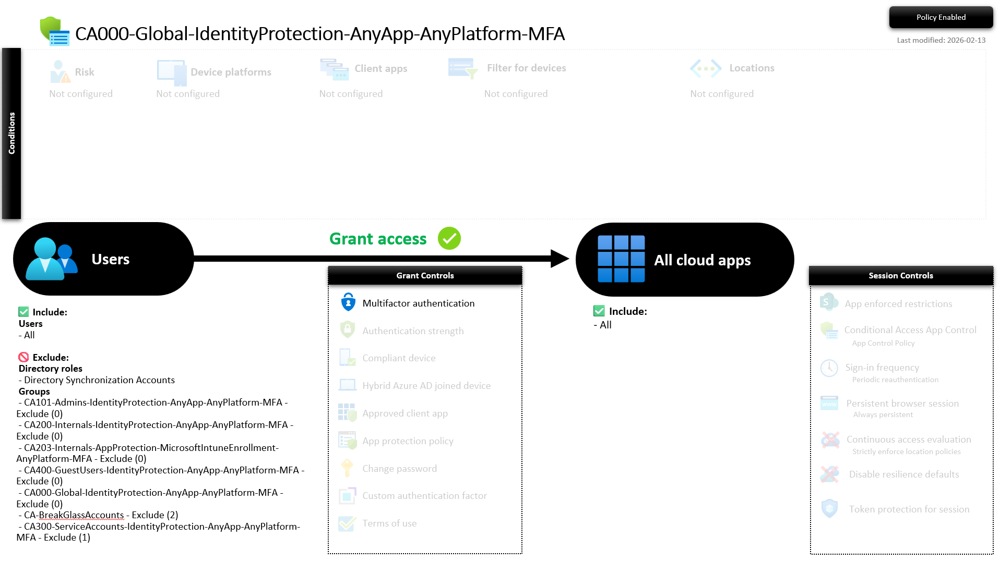

### CA001-Global-AttackSurfaceReduction-AnyApp-AnyPlatform-BLOCK-CountryWhitelist

This policy blocks all countries, to all cloud apps, from every platform except for the countries configured in the named location **ALLOWED COUNTRIES**. This named location is excluded in this policy.

> [!IMPORTANT]
> Modify the named location with your approved countries. By default only Belgium, Luxembourgh and Netherlands are allowed to have access from.

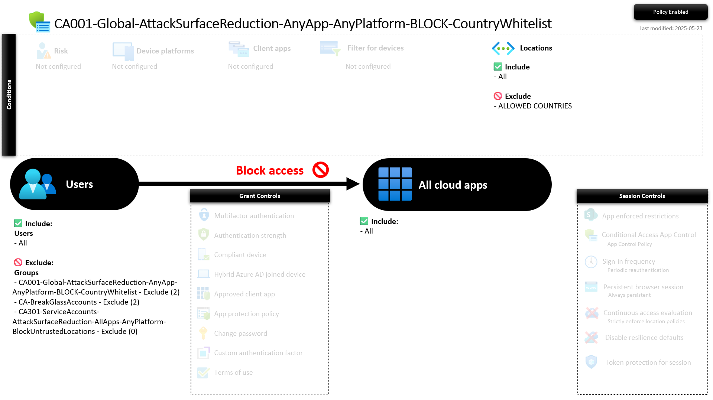

### CA002-Global-IdentityProtection-AnyApp-AnyPlatform-Block-LegacyAuthentication

This policy blocks legacy authentication for all users, to all cloud apps, from any platform.


### CA003-Global-BaseProtection-RegisterOrJoin-AnyPlatform-MFA

This policy requires MFA for all users, to register or join a device to your tenant/environment.

> [!TIP]
> Make sure to disable *Require Multifactor Authentication to register or join devices with Microsoft Entra*. This can be found under https://portal.azure.com -> Entra ID -> Devices -> Device settings.

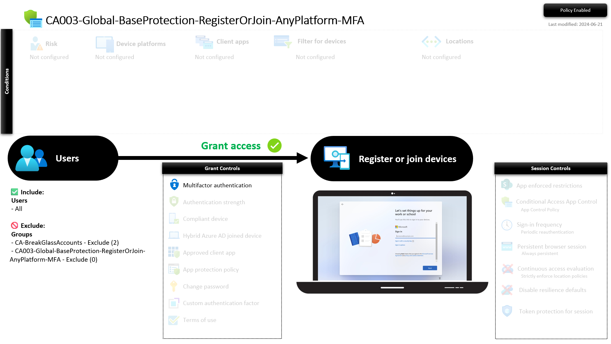

### CA004-Global-IdentityProtection-AnyApp-AnyPlatform-AuthenticationFlows

This policy prevents all users from transfering authentication flows from PC to mobile for example. This feature is currently in preview.

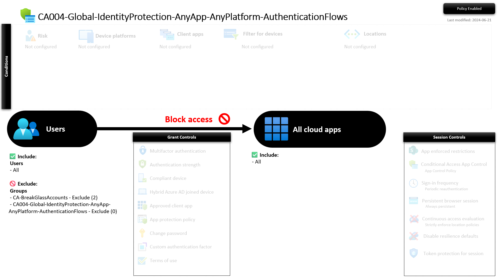

### CA005-Global-DataProtection-Office365-AnyPlatform-Unmanaged-AppEnforcedRestrictions-BlockDownload

This policy prevents all users from downloading, printing or syncing Office 365 data from an unmanaged device. It requires App Enforce Restrictions.

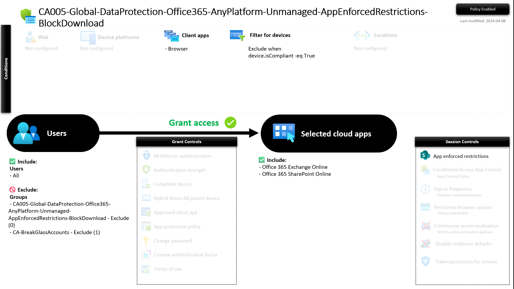

### CA006-Global-DataProtection-Office365-iOSenAndroid-RequireAppProtection

This policy requires App Protection policies for all users when accessing Office 365 data from iOS or Android devices. Admin roles are excluded to make sure the Microsoft 365 App's on the iOS and Android devices do work. This one is designed on the principle that admin roles are only assigned to admin accounts!

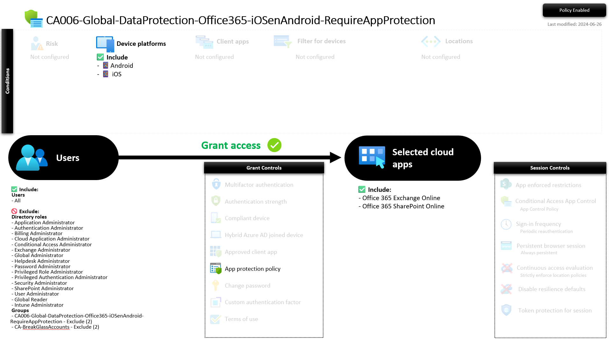

### CA100-Admins-IdentityProtection-AdminPortals-AnyPlatform-MFA

This policy requires MFA for certain admin roles when they access the access Admin Portals. This one is designed on the principle that admin roles are only assigned to admin accounts!

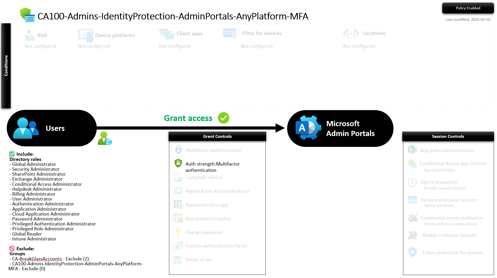

### CA101-Admins-IdentityProtection-AnyApp-AnyPlatform-MFA

This policy requires MFA for certain admin roles when they access the any cloud app. This one is designed on the principle that admin roles are only assigned to admin accounts!

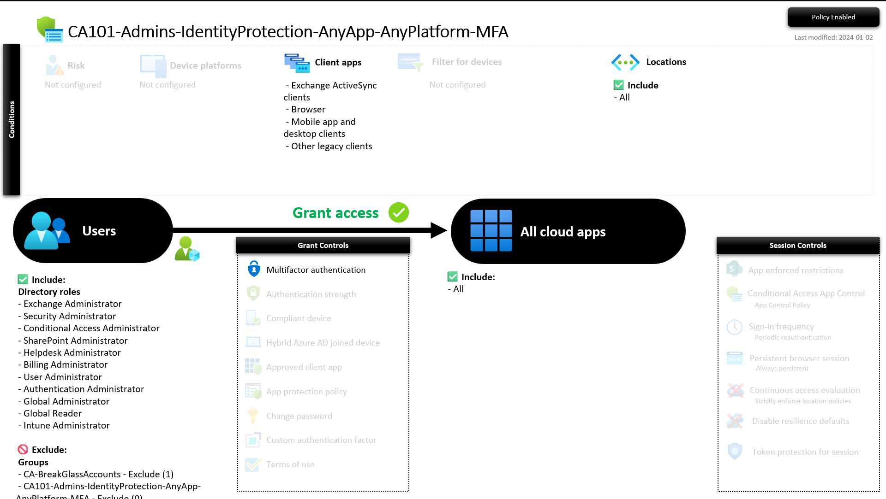

### CA102-Admins-IdentityProtection-AllApps-AnyPlatform-SigninFrequency

This policy sets a Sign-in frequency for certain admin roles to a maximum of 12 hours. Admins need to re-authenticate of logon after 12 hours.

> [!NOTE]
> Some organizations assign key roles to their primary identity (which is not ideal), leading to frequent forced sign-ins. It's recommended to assign additional roles based on your personal requirements instead.

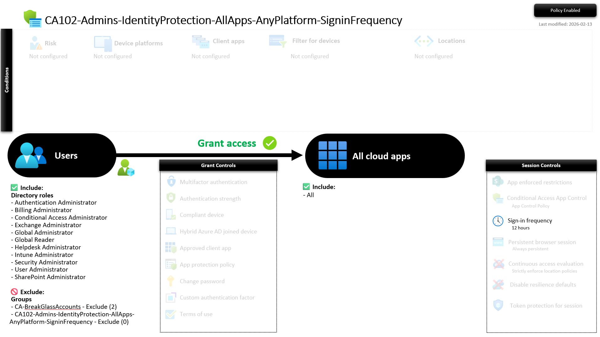

### CA103-Admins-IdentityProtection-AllApps-AnyPlatform-PersistentBrowser

This policy prevents having persistent browser sessions for admins from every device.

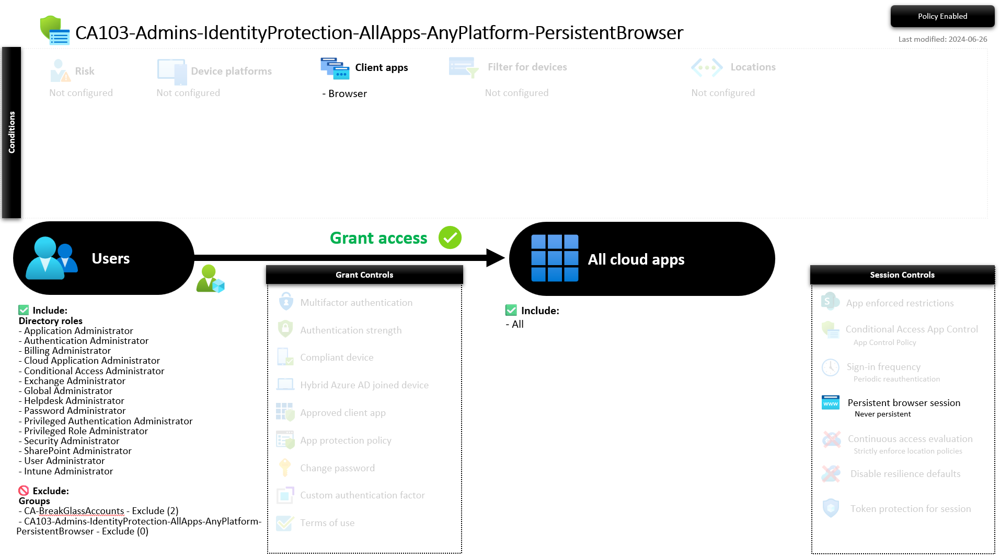

### CA104-Admins-IdentityProtection-AllApps-AnyPlatform-ContinuousAccessEvaluation

This policy allows Microsoft Entra ID to re-evaluate a user's access to resources in near real-time, rather than waiting for the typical token expiration time (which could be up to an hour). Read the Microsoft documentation here: https://learn.microsoft.com/en-us/entra/identity/conditional-access/concept-continuous-access-evaluation#conditional-access-policy-evaluation-preview

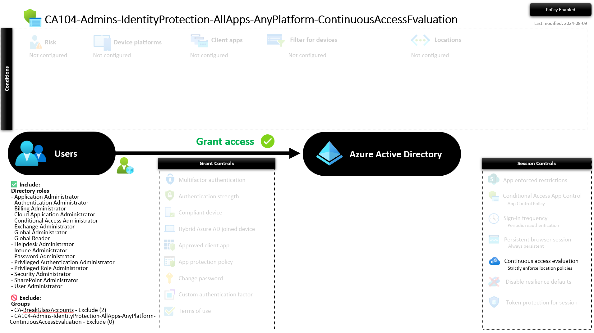

### CA105-Admins-IdentityProtection-AnyApp-AnyPlatform-PhishingResistantMFA

This policy requires Phishing Resistant MFA for admins. It does exclude Microsoft Graph Command Line Tools (cause i needed it) but you are free to remove it from your policy. It's slightly different from the Template policy. We also include Global Reader and Intune Administrators into the admin role selection.

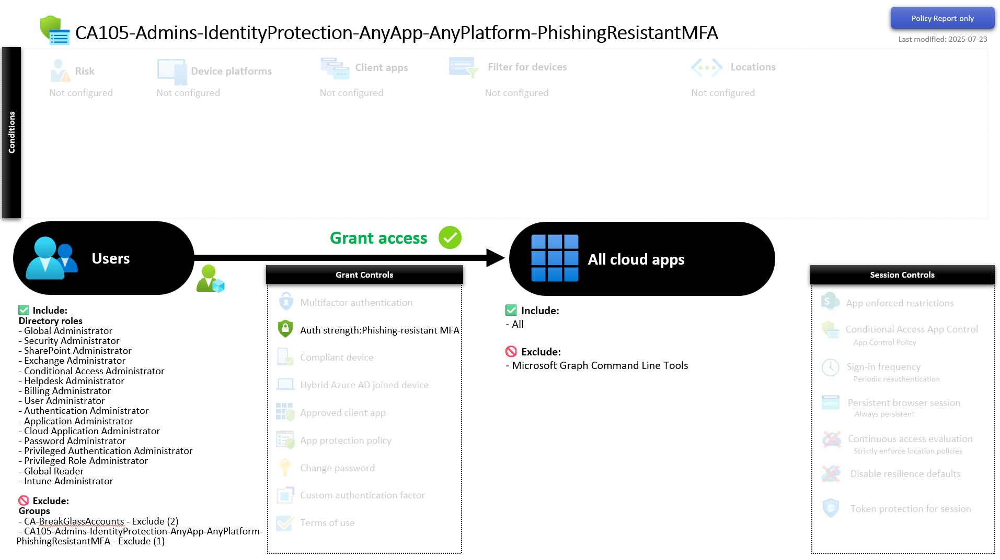

### CA200-Internals-IdentityProtection-AnyApp-AnyPlatform-MFA

This policy requires MFA for all internal identities, for all cloud applications, from any platform.


> [!IMPORTANT]
> Verify the included group(s) and/or add your custom groups which have all internals in it. APP_Microsoft365_E5 is added as an example.

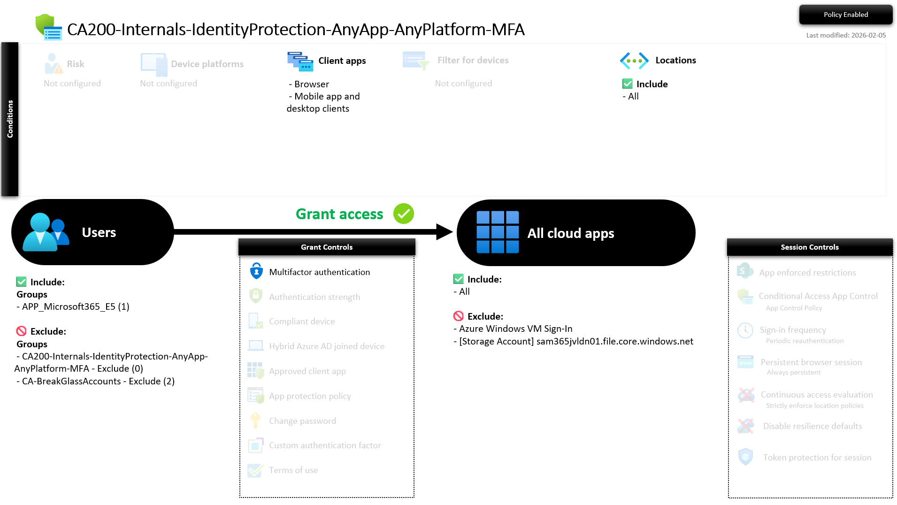

### CA201-Internals-IdentityProtection-AnyApp-AnyPlatform-BLOCK-HighRiskUser

This policy blocks all internal users which have a **high risk** (user risk) status, to all cloud apps, from all platforms.

> [!IMPORTANT]
> Verify the included group(s) and/or add your custom groups which have all internals in it. APP_Microsoft365_E5 is added as an example.


### CA202-Internals-IdentityProtection-AllApps-WindowsMacOS-SigninFrequency-UnmanagedDevices

This policy sets a Sign-in frequency to a maximum of 12 hours for internals, to all cloud apps, using unmanaged Windows or MacOS devices.

> [!IMPORTANT]
> Verify the included group(s) and/or add your custom groups which have all internals in it. APP_Microsoft365_E5 is added as an example.

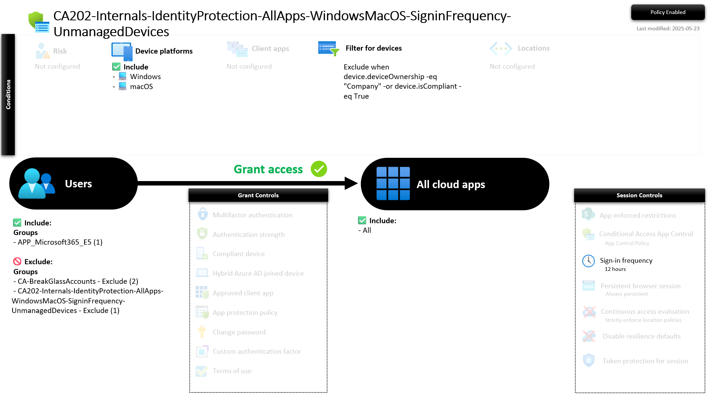

### CA203-Internals-AppProtection-MicrosoftIntuneEnrollment-AnyPlatform-MFA

This policy requires MFA for internals when enrolling their devices in Intune.

> [!IMPORTANT]
> Verify the included group(s) and/or add your custom groups which have all internals in it. APP_Microsoft365_E5 is added as an example.

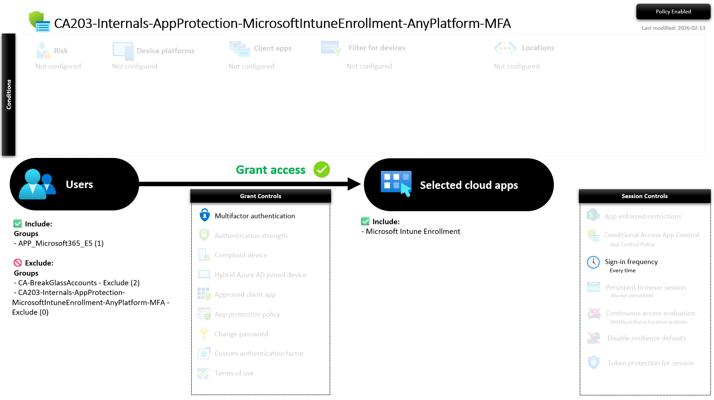

### CA204-Internals-AttackSurfaceReduction-AllApps-AnyPlatform-BlockUnknownPlatforms

This policy blocks unknown/unsupported device platforms for internals.

> [!NOTE]
> Currently only Windows, MacOS, Android and iOS are supported. If (for example) Linux or Windows Phone is allowed you need to modify the policy.

> [!IMPORTANT]
> Verify the included group(s) and/or add your custom groups which have all internals in it. APP_Microsoft365_E5 is added as an example.

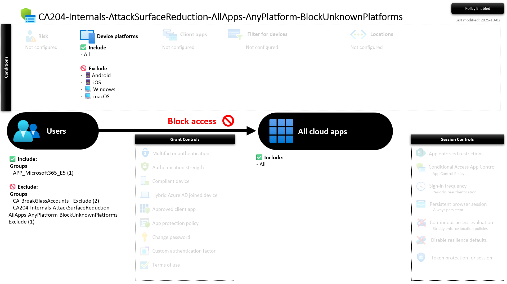

### CA205-Internals-BaseProtection-AnyApp-Windows-CompliantorAADHJ

This policy requires internals to make use of a Windows device that is compliant or AADHJ (Azure AD Hybrid Joined / Entra ID Hybrid Joined) while accessing any cloud app.

> [!IMPORTANT]
> Verify the included group(s) and/or add your custom groups which have all internals in it. APP_Microsoft365_E5 is added as an example.

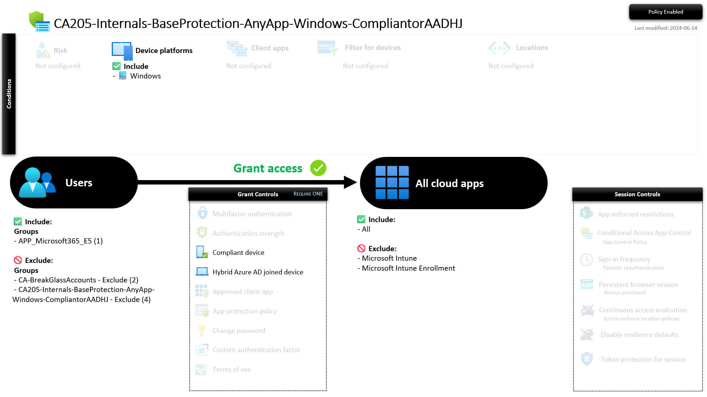

### CA206-Internals-IdentityProtection-AllApps-AnyPlatform-PersistentBrowser

This policy prevents having persistent browser sessions for internals from unmanaged devices. Managed and compliant devices are excluded from the policy.

> [!IMPORTANT]
> Verify the included group(s) and/or add your custom groups which have all internals in it. APP_Microsoft365_E5 is added as an example.


### CA207-Internals-AttackSurfaceReduction-SelectedApps-AnyPlatform-BLOCK

This policy prevents internals from accessing specific apps. In this example i've blocked a random app. You should review the included and excluded apps. Excluding office 365 is not necessary if its not included. This is just an example. 

> [!IMPORTANT]
> Verify the included group(s) and/or add your custom groups which have all internals in it. APP_Microsoft365_E5 is added as an example.

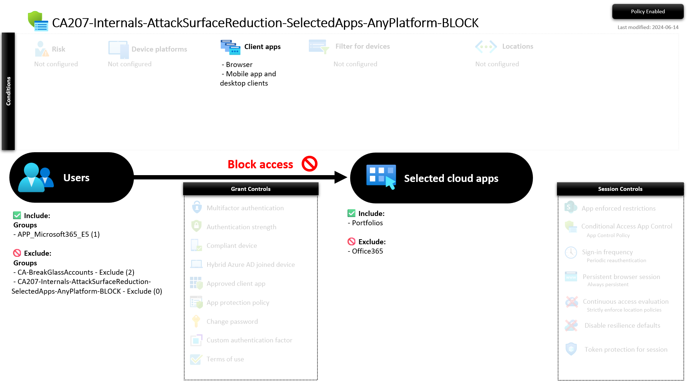

### CA208-Internals-BaseProtection-AnyApp-MacOS-Compliant

This policy requires MacOS devices to be compliant for internals.

> [!IMPORTANT]
> Verify the included group(s) and/or add your custom groups which have all internals in it. APP_Microsoft365_E5 is added as an example.

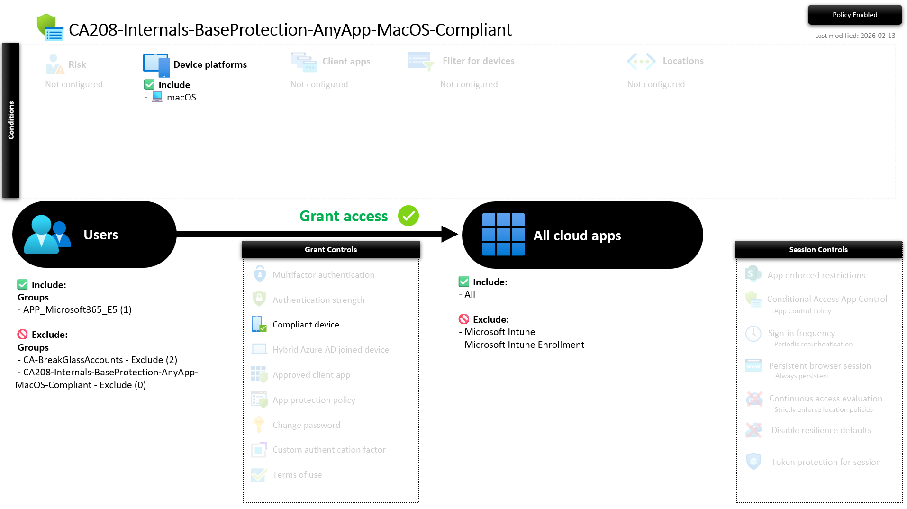

### CA209-Internals-IdentityProtection-AllApps-AnyPlatform-ContinuousAccessEvaluation

This policy allows Microsoft Entra ID to re-evaluate a user's access to resources in near real-time, rather than waiting for the typical token expiration time (which could be up to an hour). Read the Microsoft documentation here: https://learn.microsoft.com/en-us/entra/identity/conditional-access/concept-continuous-access-evaluation#conditional-access-policy-evaluation-preview.

> [!IMPORTANT]
> Verify the included group(s) and/or add your custom groups which have all internals in it. APP_Microsoft365_E5 is added as an example.

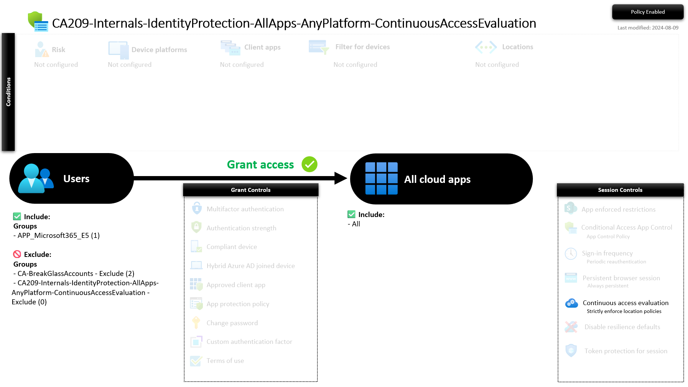

### CA210-Internals-IdentityProtection-AnyApp-AnyPlatform-BLOCK-HighRiskSignIn

This policy blocks all internal users which have a **high risk** (Sign-in risk) status, to all cloud apps, from all platforms.

> [!IMPORTANT]
> Verify the included group(s) and/or add your custom groups which have all internals in it. APP_Microsoft365_E5 is added as an example.

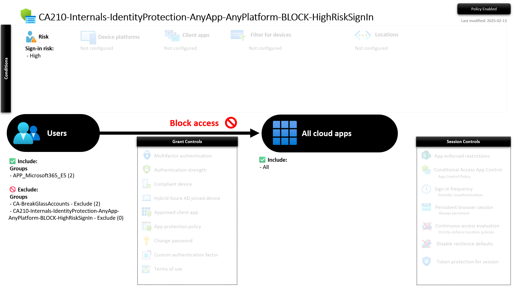

### CA400-GuestUsers-IdentityProtection-AnyApp-AnyPlatform-MFA

This policy requires guest to use MFA, from any platform when accessing any cloud app.


### CA401-GuestUsers-AttackSurfaceReduction-AllApps-AnyPlatform-BlockNonGuestAppAccess

This policy blocks access for guests to all cloud apps (except for those excluded), from any device.

> [!IMPORTANT]
> Make sure to exclude additional cloud apps if any guest needs access to these apps.

> [!NOTE]
> If you're not working with an MSP (Microsoft Partner) that requires access to your tenant, you can also block "Service Provider Users."

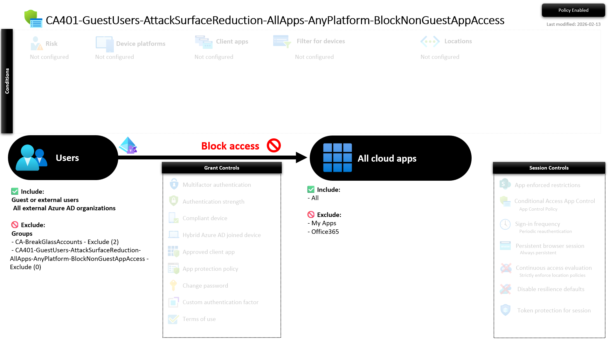

### CA402-GuestUsers-IdentityProtection-AllApps-AnyPlatform-SigninFrequency

This policy sets a Sign-in frequency to a maximum of 12 hours for guests, to all cloud apps, using any device.

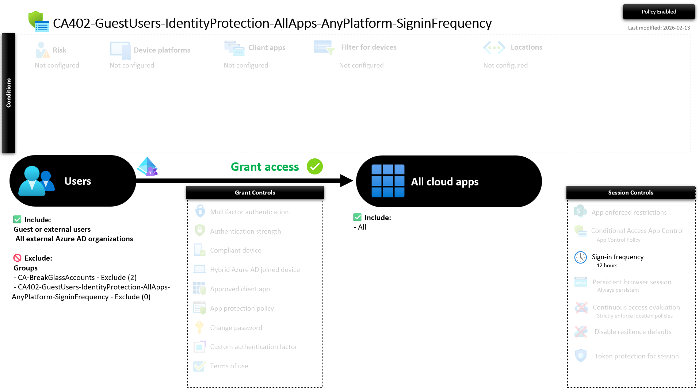

### CA403-Guests-IdentityProtection-AllApps-AnyPlatform-PersistentBrowser

This policy prevents guest from having persistent browser sessions.

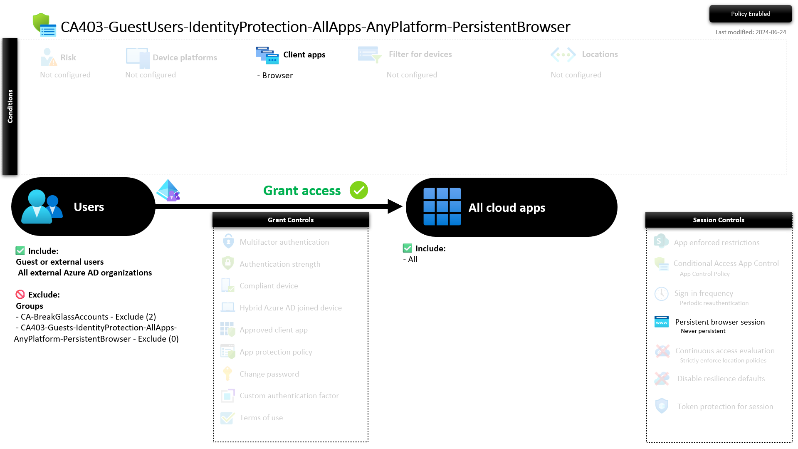

### CA404-Guests-AttackSurfaceReduction-SelectedApps-AnyPlatform-BLOCK

This policy prevents guests from accessing specific apps. In this example i've blocked a random app. You should review the included and excluded apps. Excluding office 365 is not necessary if its not included. This is just an example. 


## Named locations

| Name | Location type | Assigned to policy |
| -------- | -------- | -------- |
| ALLOWED COUNTRIES | Countries (IP) | CA001-Global-AttackSurfaceReduction-AnyApp-AnyPlatform-BLOCK-CountryWhitelist |

## Considerations
1. You might want to remove the "CA - BreakGlassAccounts - Exclude" group from Admin MFA policies (CA101, CA102) if they use MFA and/or only exclude 1 single BreakGlass account.

## Troubleshooting

1. If you encounter an error when importing policies CA203/CA205/CA208, it may be due to the absence of the "Microsoft Intune Enrollment" app in your tenant. To resolve this, recreate it using PowerShell with the following commands:
```
  Connect-AzureAD -AccountId admin@organization.onmicrosoft.com
  New-AzureADServicePrincipal -AppId d4ebce55-015a-49b5-a083-c84d1797ae8c
```

## Importing the baseline

These PowerShell scripts are using Microsoft Authentication Library (MSAL), Microsoft Graph APIs and Azure Management APIs to manage objects in Intune and Azure. The scripts has a simple WPF UI and it supports operations like Export, Import, Copy, Download, Compare etc.

This makes it easy to backup or clone a complete Intune environment. The scripts can export and import objects including assignments and support import/export between tenants. The scripts will create a migration table during export and use that for importing assignments in other environments. It will create missing groups in the target environment during import. Group information like name, description and type will be imported based on the exported group e.g. dynamic groups are supported. There will be one json file for each group in the export folder.

The script also support dependencies e.g. an App Protection is depending on an App, Policy Sets are depending on Compliance Policies, objects has Scope Tags etc. Dependency support requires exported json files and that the dependency objects are imported in the environment. The script uses the exported json files to get the Id and name's of the exported object and uses that information and updates Id's before import an object from a json file. The Bulk Import form shows the import order of the objects. The objects with the lowest order number will be imported first.

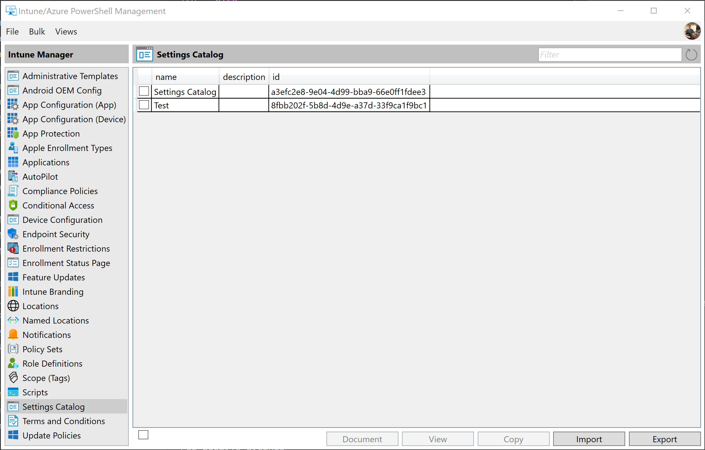

> [!TIP]
> The following tool is used: https://github.com/Micke-K/IntuneManagement. Always download the lastest version before importing or exporting data.

### Setup IntuneManagement

Start by downloading the files in GitHub. Extract the Github repo somewhere on your device. For example: *C:\Intune\IntuneManagement*.

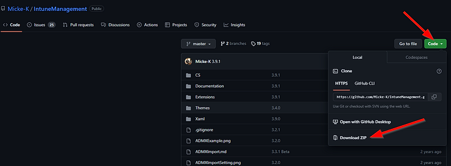

Unblock all .cmd/.ps1/.psd files with the following PowerShell command.

```
Get-ChildItem -Path "C:\Intune\IntuneManagement\" -File -Recurse | Unblock-File
```

Start the IntuneManagementTool
```
cd C:\Intune\IntuneManagement\
.\Start-IntuneManagement.ps1
```

Start by authenticating to your tenant with the profile icon in the top right.

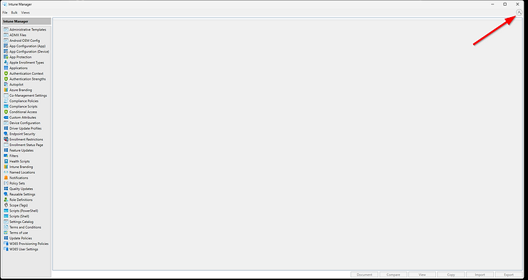

In the modern authentication window that pops up, sign in with an account that has appropriate permissions, if unsure use Global Administrator. After sign-in you will be prompted to accept permissions for Microsoft Intune PowerShell, **DO NOT** tick the box to consent on behalf of your organisation.

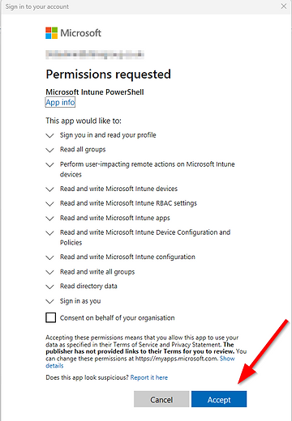

It's likely the first time you do this you'll still see you don't have access to the settings, you'll know this as the menu on the left-hand side will have all text in red, like so.

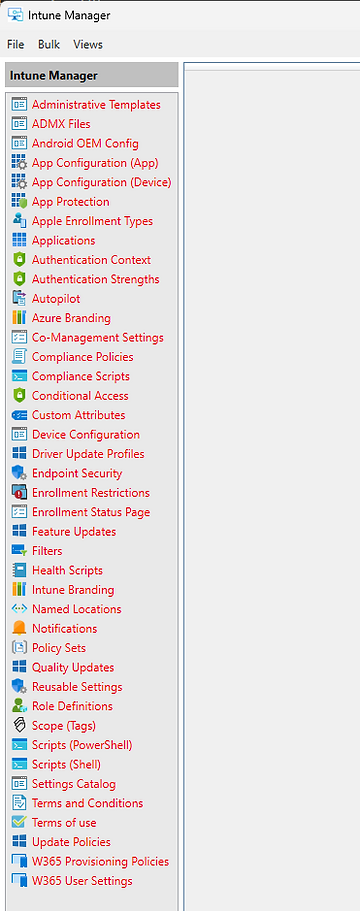

From here, select the profile icon in the top right corner and then Request Consent again.


Go ahead and accept the popup again, this should clear all the red text on the left hand-side. **DO NOT** tick the box to consent on behalf of your organisation.

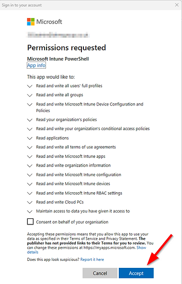

Now we can start importing, exporting, or comparing tenant configurations. 

### Import the configuration

1: Click on **Bulk** -> **Import**

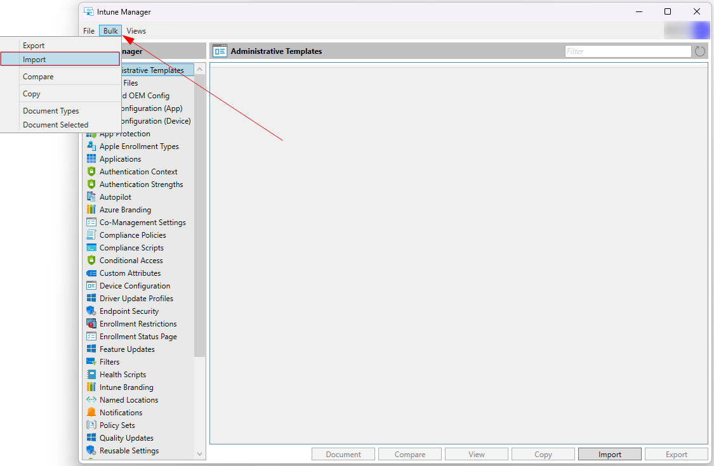

2: Select the folder where you stored the conditional access policies.

3: Decide if you want to import all the assignments or assign all policies yourself.

4: Set "Conditional Access State" to **Off** or **Report-only**. Don't forget to enable these later! This should be done after MFA is setup for an Global Admin account and (if required) a Break the Glass account is created.

5: Click **Import**

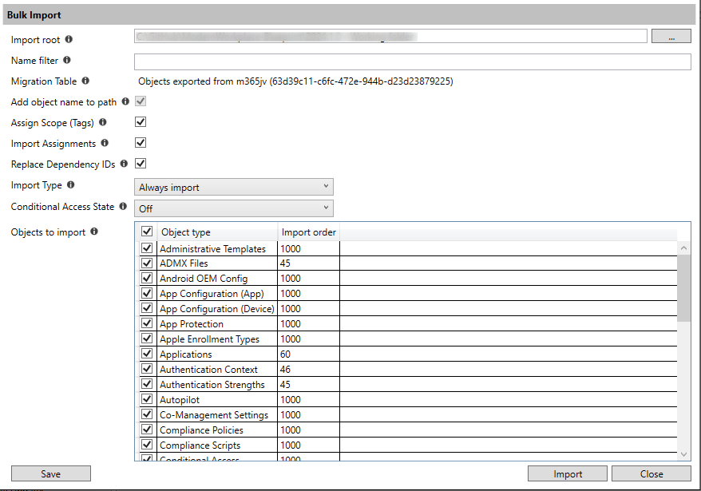

Once the importing is complete, all policies will be available for you to modify and/or enable them.

> [!CAUTION]
> Be careful activating the policies! Make sure you have decent exclusions and/or a break the glass account in place. Enable the policies one by one or start with report-only.

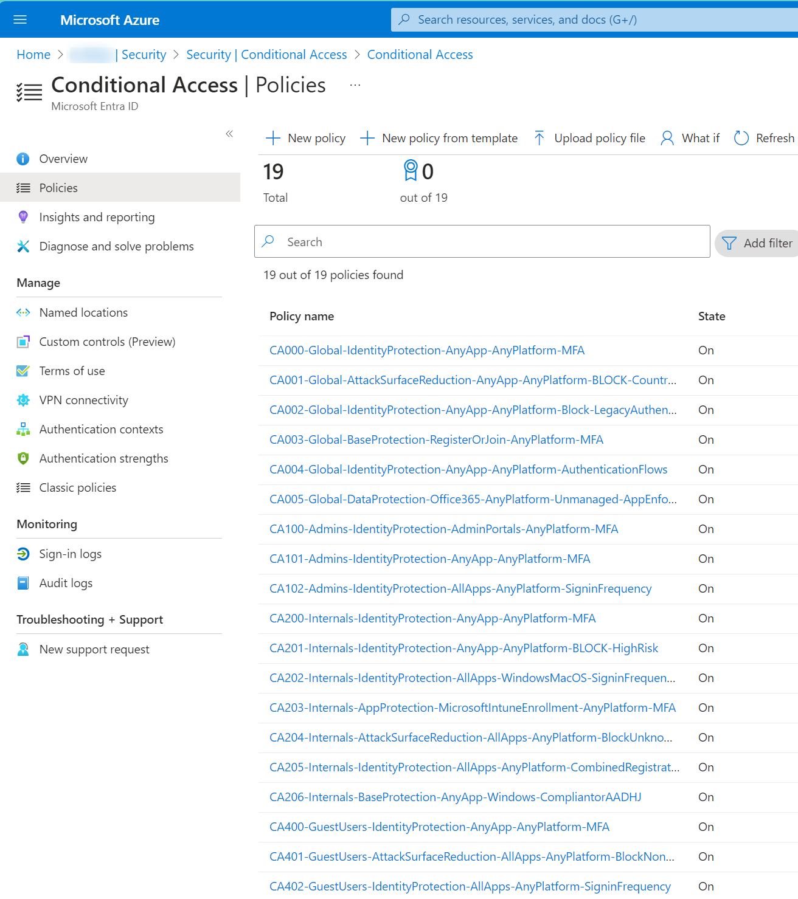
